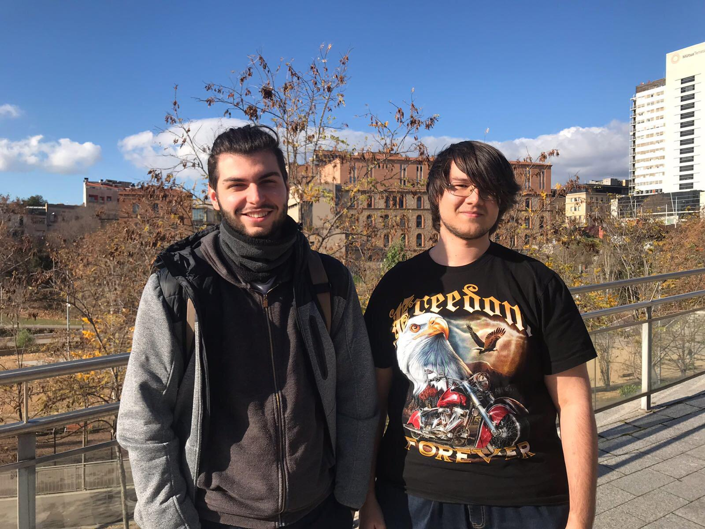

# Wizard's power

## Introduction
We are two students from CITM Terrassa, in second grade of game design. This project has been done for the subject of videogame development. Since we started the subject we have been applying what we were learning in class in this project.So here you can see our final result.
In the game you will take on the role of a magician who will have to get stronger knowing new spells, thanks to the magic books that are around the town. But it will not be so easy to get them because the town is full of enemies and a final boss waiting at the end of town.
Good luck!

## Team

The boy on the right(Manel Mourelo):
  - Manager, programmer and designer

Github profile: [https://github.com/manelmourelo](https://github.com/manelmourelo).

The boy on the left(Víctor Tirado):
  - Artist, programmer and designer

Github profile: [ https://github.com/VictorTirado]( https://github.com/VictorTirado).

## Evolution
We started the project learning how to use Tiled an pugi, thanks to this we could do a simple platformer game loading from Tiled the map and the option to save and load the position of the player.
Later we learned pathfinding, starting from BFS, dijkstra and finally A*. After that we started to control the framerate in the game, capping the FPS or using dt. Once we implemented that in the game we started to use Brofiler, a tool that can help us to know how efficent is our code.
And finally we implemented the user interface and HUD in the game.
Out of the core requirements we implemented a module that controls all the abilities, a mana system and  an in game menu.

## Links
* You can see our repositoy [here](https://github.com/VictorTirado/Game-Development).
* You can download the last version [here](https://github.com/VictorTirado/Game-Development/releases/tag/2.0)!

## Gameplay
Here you can see a short gameplay: 
<iframe width="854" height="480" src="https://www.youtube.com/embed/iAVfr9ZQJWo" frameborder="0" gesture="media" allow="encrypted-media" allowfullscreen></iframe>

## Controls
*  Q ➲ Ice attack
*  E ➲ Melee attack (thunder)
*  R ➲ Distance attack (fireball)
*  A ➲ Move left
*  D ➲ Move right
*  SPACE ➲ Jump
*  L-SHIFT (while jumping) ➲ Levitate
*  W (if god mode) ➲ Fly
*  S (if god mode) ➲ Descend
* ESC (in game) ➲ Open menu

Debug Keys:
* F1 ➲ Start first level
* F2 ➲ Start from the beginning of the current level
* F5 ➲ Save the current state
* F6 ➲ Load the previous state
* F8 ➲ Debug UI
* F9 ➲ View colliders and pathfinding
* F10 ➲ God Mode
* F11 ➲ Enable/disable FPS

## License
MIT License

Copyright (c) [2017] [Víctor Tirado Fernández and Manel Mourelo Montero]

Permission is hereby granted, free of charge, to any person obtaining a copy of this software and associated documentation files (the "Software"), to deal in the Software without restriction, including without limitation the rights to use, copy, modify, merge, publish, distribute, sublicense, and/or sell copies of the Software, and to permit persons to whom the Software is furnished to do so, subject to the following conditions:

The above copyright notice and this permission notice shall be included in all copies or substantial portions of the Software.

THE SOFTWARE IS PROVIDED "AS IS", WITHOUT WARRANTY OF ANY KIND, EXPRESS OR IMPLIED, INCLUDING BUT NOT LIMITED TO THE WARRANTIES OF MERCHANTABILITY, FITNESS FOR A PARTICULAR PURPOSE AND NONINFRINGEMENT. IN NO EVENT SHALL THE AUTHORS OR COPYRIGHT HOLDERS BE LIABLE FOR ANY CLAIM, DAMAGES OR OTHER LIABILITY, WHETHER IN AN ACTION OF CONTRACT, TORT OR OTHERWISE, ARISING FROM, OUT OF OR IN CONNECTION WITH THE SOFTWARE OR THE USE OR OTHER DEALINGS IN THE SOFTWARE.
